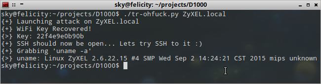

# TR-06fail - TR-064 Misimplementations leading to remote device takeover in ZyXEL Routers

TL;DR: TR-064 implementation on a whole load of ZyXEL routers allows remote attackers on the WAN side to dump configuration information including the ESSID, BSSID, WPA Passphrase, and other fun stuff.

Better still, on the Eir D1000 variant, the SetNTPServers method is vulnerable to command injection. So we can disable firewall stuff and SSH into the device (as it uses the WiFi password as the SSH user password for the "admin" (root) account.

## Screenshot (from LAN side, I didn't want my home IP in here or anything).

